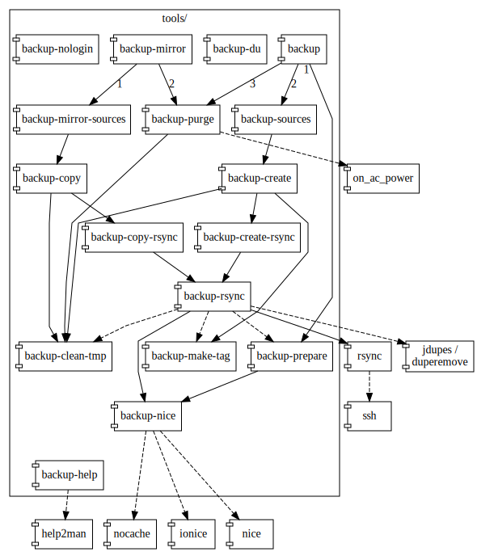

Backup tools
============

 - **[backup]**:                create a new backup directory and do related tasks
 - **[backup-clean-tmp]**:      clean up a temporary directory
 - **[backup-copy]**:           copy backup directories
 - **[backup-copy-rsync]**:     a backup copying oriented file-copying tool
 - **[backup-create]**:         create a new backup directory
 - **[backup-create-rsync]**:   a backup creation oriented file-copying tool
 - **[backup-du]**:             estimate file space usage
 - **[backup-make-tag]**:       construct a new backup directory name
 - **[backup-mirror]**:         copy backup directories and do related tasks
 - **[backup-mirror-sources]**: copy backup directories from mirror sources
 - **[backup-nice]**:           run a backup command nicely
 - **[backup-nologin]**:        politely refuse a login but allow a backup
 - **[backup-prepare]**:        prepare for backups
 - **[backup-purge]**:          delete old backup directories
 - **[backup-rsync]**:          a backup-oriented file-copying tool
 - **[backup-sources]**:        create a new backup directory from backup sources

Requirements
------------

Minimum requirements:
 - Essential POSIX-compiliant utilities
   **[**(1),
   **basename**(1),
   **cat**(1),
   **echo**(1),
   **chgrp**(1),
   **chmod**(1),
   **cp**(1),
   **dirname**(1),
   **find**(1),
   **grep**(1),
   **id**(1),
   **ln**(1),
   **ls**(1),
   **mkdir**(1),
   **mv**(1),
   **printf**(1),
   **rm**(1),
   **rmdir**(1),
   **sh**(1),
   **sync**(1) and
   **uname**(1)
 - **rsync**(1):        To copy files.

Optional requirements:
 - **hostname**(1):     To get the system's hostname.
 - **ionice**(1):       To set idle I/O priority.
 - **nice**(1):         To add niceness.
 - **nocache**(1):      To minimize the effect on file system cache.
 - **on_ac_power**(1):  To test whether computer is running on AC power.
 - **renice**(1):       To readd niceness.
 - **ssh**(1):          To copy files from another host.
 - **fmt**(1),
   **help2man**(1),
   **man**(1),
   **tput**(1):         To format help messages.

**backup**
----------
[backup]: #backup

Prepare for backups by executing preparation scripts, read backup
sources from configuration files, create a new backup directory from the
backup sources using **rsync**(1) and then delete old backup directories
based on pattern matching and ages.
For details, see **[backup-prepare]**\(1\), **[backup-sources]**\(1\)
and **[backup-purge]**\(1\).

The preparation scripts can be used for dumping database snapshots to
files, for instance.

The newly created backup directory is named according to the backup date
and time and is a full backup directory containing direct (but possible
filtered) copies of original files and directories. It can thus be
accessed and restored directly.

Old backup directories are deleted based on pattern matching and ages.
The default is to keep secondly, minutely and hourly backup directories
for at most one day covering hours since the last daily backup, daily
backup directories for at least one week covering days since the last
weekly backup, weekly backup directories for at least one month covering
weeks since the last monthly backup, monthly backup directories for at
least one year covering months since the last yearly backup and yearly
backup directories forever.

For a reference manual,
run
`tools/backup --help` or
`tools/backup --help=man`.

**backup-clean-tmp**
--------------------
[backup-clean-tmp]: #backup-clean-tmp

Remove stale subdirectories from a temporary directory.

For a reference manual,
run
`tools/backup-clean-tmp --help` or
`tools/backup-clean-tmp --help=man`.

**backup-copy**
---------------
[backup-copy]: #backup-copy

Copy backup directories from sources using **[backup-copy-rsync]**\(1\)
and thus **rsync**(1).

Disk usage is minimised and transfers are speeded up by hard linking
files from old backup directories to newly created backup directories
whenever possible (when files in sources and previous backup directories
are identical in content and in all preserved attributes).
On the btrfs and s3ql filesystems, hard linking is not needed and is
therefore not used for disk usage minimisation.

For a reference manual,
run
`tools/backup-copy --help` or
`tools/backup-copy --help=man`.

**backup-copy-rsync**
---------------------
[backup-copy-rsync]: #backup-copy-rsync

Copy files using **[backup-rsync]**\(1\) and thus **rsync**(1) with
backup copying related options.

For a reference manual,
run
`tools/backup-copy-rsync --help` or
`tools/backup-copy-rsync --help=man`.

**backup-create**
-----------------
[backup-create]: #backup-create

Create a new backup directory using **[backup-create-rsync]**\(1\) and
thus **rsync**(1).

The newly created backup directory is named according to the backup date
and time and is a full backup directory containing direct (but possible
filtered) copies of original files and directories. It can thus be
accessed and restored directly.

Disk usage is minimised and the transfer is speeded up by hard linking
files from old backup directories to the newly created backup directory
whenever possible (when files in sources and previous backup directories
are identical in content and in all preserved attributes).
On the btrfs and s3ql filesystems, hard linking is not needed and is
therefore not used for disk usage minimisation.

For a reference manual,
run
`tools/backup-create --help` or
`tools/backup-create --help=man`.

**backup-create-rsync**
-----------------------
[backup-create-rsync]: #backup-create-rsync

Copy files using **[backup-rsync]**\(1\) and thus **rsync**(1) with
backup creation related options.

For a reference manual,
run
`tools/backup-create-rsync --help` or
`tools/backup-create-rsync --help=man`.

**backup-du**
-------------
[backup-du]: #backup-du

Summarize disk usage by counting used and releasable blocks and their
sizes.

For a reference manual,
run
`tools/backup-make-du --help`.

**backup-make-tag**
-------------------
[backup-make-tag]: #backup-make-tag

Construct a new backup backup directory name based on date and time and
the names of the existing backup directories.

For a reference manual,
run
`tools/backup-make-tag --help` or
`tools/backup-make-tag --help=man`.

**backup-mirror**
-----------------
[backup-mirror]: #backup-mirror

Read mirror sources from configuration files, copy backup directories
from the mirror sources using **rsync**(1) and then delete old backup
directories based on pattern matching and ages.
For details, see **[backup-mirror-sources]**\(1\) and
**[backup-purge]**\(1\).

For a reference manual,
run
`tools/backup-mirror --help` or
`tools/backup-mirror --help=man`.

**backup-mirror-sources**
-------------------------
[backup-mirror-sources]: #backup-mirror-sources

Read mirror sources from configuration files and copy backup directories
from the mirror sources using **rsync**(1).
For details, see **[backup-copy]**\(1\).

For a reference manual,
run
`tools/backup-mirror-sources --help` or
`tools/backup-mirror-sources --help=man`.

**backup-nice**
---------------
[backup-nice]: #backup-nice

Run a backup command with idle I/O priority (whose impact on normal
system activity should be zero), with an adjusted niceness (which affect
process scheduling) and with minimized effect on file system cache
provided that the commands **ionice**(1), **nice**(1) and **nocache**(1)
are available.

For a reference manual,
run
`tools/backup-nice --help` or
`tools/backup-nice --help=man`.

**backup-nologin**
------------------
[backup-nologin]: #backup-nologin

Politely refuse a login but allow **[backup-rsync]**\(1\) to be executed
via a remote shell.

**backup-prepare**
------------------
[backup-prepare]: #backup-prepare

Prepare for backups by executing preparation scripts.
This can be used for dumping database snapshots to files, for instance.

Preparation is done with idle I/O priority (whose impact on normal
system activity should be zero), with an adjusted niceness (which affect
process scheduling) and with minimized effect on file system cache
provided that the commands **ionice**(1), **nice**(1) and **nocache**(1)
are available.
For details, see **[backup-nice]**\(1\).

For a reference manual,
run
`tools/backup-prepare --help` or
`tools/backup-prepare --help=man`.

**backup-purge**
----------------
[backup-purge]: #backup-purge

Delete old backup directories based on pattern matching and ages.
The default is to keep secondly, minutely, hourly and fake daily backup
directories for at most one day, daily and fake weekly backup
directories for at least one week, weekly and fake monthly backup
directories for at least one month, monthly and fake yearly backup
directories for at least one year and yearly backup directories forever.

Deletion is done with idle I/O priority (whose impact on normal system
activity should be zero), with an adjusted niceness (which affect
process scheduling) and with minimized effect on file system cache
provided that the commands **ionice**(1), **nice**(1) and **nocache**(1)
are available.
For details, see **[backup-nice]**\(1\).

For a reference manual,
run
`tools/backup-purge --help` or
`tools/backup-purge --help=man`.

**backup-rsync**
----------------
[backup-rsync]: #backup-rsync

Copy files using **rsync**(1) with backup related options.

Copying is done with idle I/O priority (whose impact on normal system
activity should be zero), with an adjusted niceness (which affect
process scheduling) and with minimized effect on file system cache
provided that the commands **ionice**(1), **nice**(1) and **nocache**(1)
are available.
For details, see **[backup-nice]**\(1\).

For a reference manual,
run
`tools/backup-rsync --help` or
`tools/backup-rsync --help=man`.

**backup-sources**
------------------
[backup-sources]: #backup-sources

Read backup sources from configuration files and create a new backup
directory from the backup sources using **rsync**(1).
For details, see **[backup-create]**\(1\).

The newly created backup directory is named according to the backup date
and time and is a full backup directory containing direct (but possible
filtered) copies of original files and directories. It can thus be
accessed and restored directly.

For a reference manual,
run
`tools/backup-sources --help` or
`tools/backup-sources --help=man`.

Copyright
---------

Copyright (C) 2010 - 2021 Eero Häkkinen <Eero+rsync-backup@Häkkinen.fi>

This program is free software: you can redistribute it and/or modify
it under the terms of the GNU General Public License version 3
as published by the Free Software Foundation.

This program is distributed in the hope that it will be useful,
but WITHOUT ANY WARRANTY; without even the implied warranty of
MERCHANTABILITY or FITNESS FOR A PARTICULAR PURPOSE.  See the
GNU General Public License for more details.

You should have received a copy of the GNU General Public License
along with this program.  If not, see <http://www.gnu.org/licenses/>.
